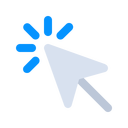

  

<h1 align="center">Auto Clicker</h1>

  A lightweight, cross-platform auto-clicking utility for Windows, macOS, and Linux.

  
  
  
  

---

## Overview

**Auto Clicker** is a small desktop app for automating mouse clicks with precise timing. It runs natively on Windows, macOS, and Linux (including Chrome OS), with a clean, simple interface designed for repetitive-click use cases — testing, gaming, form filling, or any workflow where you need clicks fired on a schedule instead of by hand.

It ships as a ready-to-run app for each platform, with a global hotkey to start/stop from anywhere and a system tray presence so it stays out of your way.

## Features

- 🖱️ **Configurable click loop** — set interval (hours/minutes/seconds/milliseconds), mouse button (left/right/middle), and single or double click
- 🔁 **Flexible repeat modes** — click a fixed number of times or run until stopped
- 🎯 **Fixed or current position clicking** — click wherever the cursor is, or lock to a screen coordinate you pick visually
- ⌨️ **Global hotkey toggle** — start/stop clicking from any window with a customizable hotkey (default `F6`)
- 🧰 **System tray support** — minimize to tray or taskbar, with your preference remembered
- ⚙️ **Persistent settings** — all click parameters and preferences are saved between sessions
- 🔄 **Automatic updates** — the app checks for and installs new versions on its own
- 🛑 **Safety net for bad releases** — if a shipped version ever has a serious issue, affected installs are notified and shut down gracefully instead of silently continuing
- 🧪 **Reliability tested** — core click logic, settings, and update behavior are covered by an internal test suite

## Showcase

> Auto Clicker in a few numbers and highlights:

| | |
|---|---|
| 🖥️ **Cross-platform** | One app, native experience on Windows, macOS, and Linux |
| ⚡ **Sub-millisecond accuracy** | Precision timing keeps click intervals tight even at high frequency |
| 🪶 **Lightweight** | No background services beyond the app itself — starts, clicks, and gets out of the way |
| 🔐 **Signed & verified releases** | Every release is signed to protect against tampering |
| 🚀 **Continuously delivered** | New builds are tested and published automatically |

*(Add screenshots or a short GIF of the app here once available — a picture of the click-settings panel and tray icon in action goes a long way for new visitors.)*

## Release & Support Lifecycle

| Version | Status | Platforms | Notes | Support Ends |
|---------|--------|-----------|-------|---------------|
| 1.0.0   | ✅ Current | Windows, macOS, Linux | Initial public release | — |
| 1.0.1   | 🔜 Planned | — | — | — |

**Legend:** ✅ Current • 🔧 Maintenance (critical fixes only) • 🚫 End of life (no longer supported)

> If a release ever ships with a serious issue, it can be remotely retired. Affected installs are notified on their next check-in and prompted to update.

## Supported Platforms & Versions

| Platform | Minimum Version | Architecture | Status |
|----------|------------------|---------------|--------|
| Windows  | Windows 10 (1809+) | x64 | ✅ Fully supported |
| macOS    | macOS 12 (Monterey)+ | Apple Silicon, Intel (x64) | ✅ Fully supported |
| Linux    | Ubuntu 20.04+ / equivalent | x64 | ✅ Fully supported |
| Chrome OS | Recent Chrome OS with Linux (Crostini) enabled | x64 | ⚠️ Supported via Linux container |

> Older OS versions may still work but are untested and unsupported. If you run into issues on an unlisted platform or version, please open an issue with your OS details.

## Getting Started

### Download

Grab the latest release for your platform from the [Releases](../../releases) page:

- **Windows** — download and run the installer/executable
- **macOS** — download the `.dmg`, then drag the app into Applications
- **Linux** — download the release for your distribution and run it

No additional setup, runtimes, or dependencies are required — just download and launch.

### Platform-specific notes

- **macOS** — the app needs **Accessibility** permission under *System Settings → Privacy & Security → Accessibility* for clicks to register. macOS will prompt you for this on first launch.
- **Linux (Wayland)** — works out of the box under most desktop sessions. On a pure-Wayland session without XWayland, you may need to grant input-device access (add your user to the `input` group).
- **Chrome OS** — supported via the Linux (Crostini) environment.

## Usage

1. Launch the app.
2. Set your desired interval, mouse button, click type, and repeat mode.
3. Choose **current position** or pick a **fixed position** on screen.
4. Press **Start** (or your configured hotkey — default `F6`) to begin clicking, and press it again to stop.
5. Minimize to the tray or taskbar to keep it running in the background.

## Feedback & Issues

Found a bug or have a feature request? Please open an issue describing what happened, your OS, and the app version.

## License

This project is proprietary software — see the [LICENSE](LICENSE) file for full terms.

**In short:** you may download and use the app, but you may **not** modify it, claim ownership of it, or redistribute it as your own without prior written permission from the publisher.

## Disclaimer

Auto-clicking may violate the terms of service of some games, applications, or platforms. Use responsibly and at your own risk.
